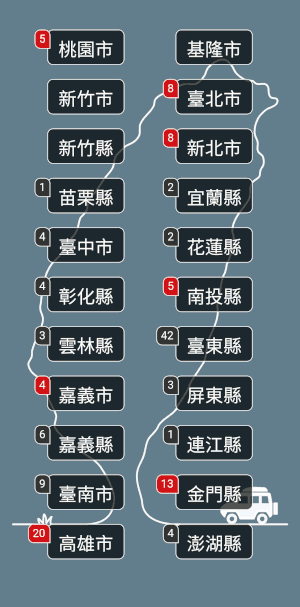

# Taiwan Tourism (旅遊台灣)

This is an app integrates with open APIs from Taiwan MOTC (Ministry of Transportation and Communications) to fetch tourism information and city forecasts. Data sources include:

 [PTX (Public Transport Data eXchange)](https://ptx.transportdata.tw/PTX/About/EnPlatform)

 [CWB (Central Weather Bureau) Open Weather Data](https://opendata.cwb.gov.tw)

此應用程式介接台灣交通部[公共運輸整合資訊流通服務平臺](https://ptx.transportdata.tw/PTX)以及中央氣象局[氣象資料開放平臺](https://opendata.cwb.gov.tw)的開放式API，用以即時查詢各縣市的觀光活動與天氣預報。

## Screenshots (畫面展示)

## Download Links (下載連結)

